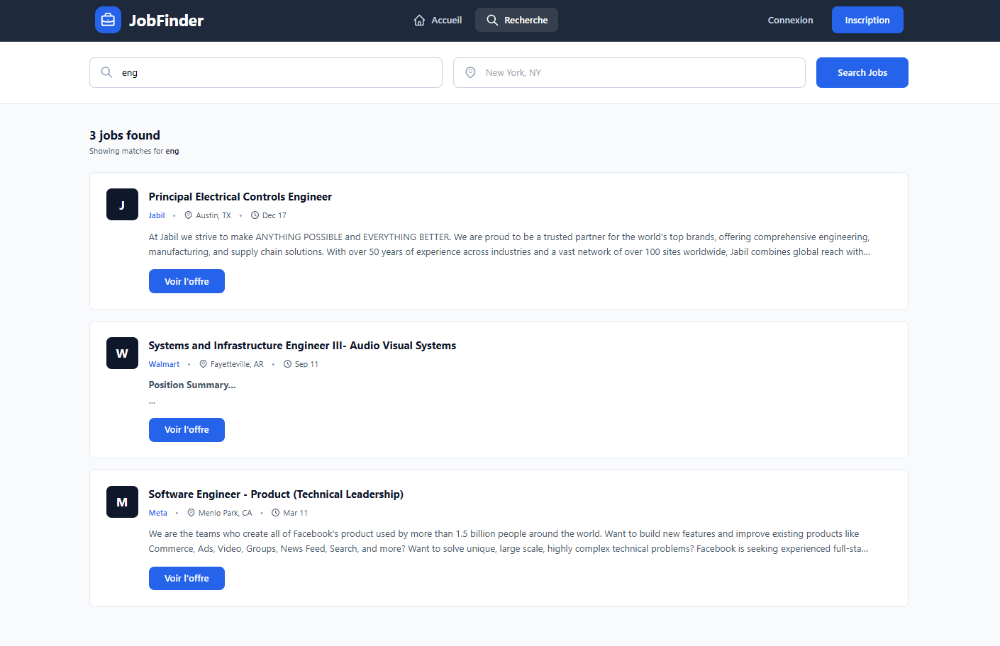
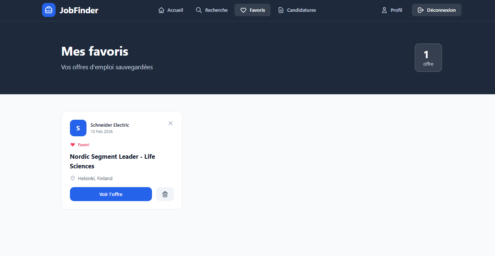

# 🎯 JobFinder

Application web moderne de recherche d'emploi développée avec **Angular 19**.

---

## 📸 Aperçu


---

## 📋 Table des matières

- [Screenshots](#-screenshots)
- [Fonctionnalités](#-fonctionnalités)
- [Technologies](#-technologies)
- [Prérequis](#-prérequis)
- [Installation](#-installation)
- [Démarrage](#-démarrage)
- [Architecture](#-architecture)
- [API](#-api)
- [Gestion d'état](#-gestion-détat)
- [Licence](#-licence)

---

# 📸 Screenshots

## 🔐 Authentification

### Connexion


### Inscription


---

## 🏠 Page d'accueil


---

## 🔎 Recherche d'emploi



---

## ⭐ Mes Favoris



---

## 📝 Mes Candidatures


---

## 👤 Profil Utilisateur


---

# ✨ Fonctionnalités

### 🔐 Authentification
- Inscription et connexion des utilisateurs
- Gestion de profil utilisateur
- Guards de protection des routes
- Persistance de session

### 🔍 Recherche d'emploi
- Recherche par mots-clés et localisation
- Intégration avec l'API The Muse
- Affichage des résultats en grille responsive
- Pagination des résultats

### ⭐ Gestion des favoris
- Ajout/suppression d'offres en favoris
- Affichage en grille de cartes
- Synchronisation avec le backend
- Gestion d'état avec NgRx

### 📝 Suivi des candidatures
- Ajout de candidatures avec statut (en attente, accepté, refusé)
- Notes personnelles pour chaque candidature
- Filtrage par statut
- Statistiques des candidatures
- Modification du statut et des notes

### 👤 Profil utilisateur
- Modification des informations personnelles
- Gestion de l'email
- Suppression de compte

## 🛠 Technologies

- **Framework**: Angular 19.2.19
- **Langage**: TypeScript 5.7
- **Gestion d'état**: NgRx (Store, Effects)
- **Styling**: Tailwind CSS
- **HTTP Client**: Angular HttpClient
- **Routing**: Angular Router
- **Forms**: Reactive Forms
- **Backend Mock**: JSON Server

## 📦 Prérequis

- Node.js (v18 ou supérieur)
- npm (v9 ou supérieur)
- Angular CLI (`npm install -g @angular/cli`)

## 🚀 Installation

1. Cloner le repository
```bash
git clone <repository-url>
cd job-finder
```

2. Installer les dépendances
```bash
npm install
```

3. Installer JSON Server (si ce n'est pas déjà fait)
```bash
npm install -g json-server
```

## 🎬 Démarrage

### Démarrer le serveur de développement Angular

```bash
ng serve
```

L'application sera accessible sur `http://localhost:4200/`

### Démarrer le serveur JSON Server (backend mock)

Dans un autre terminal :

```bash
json-server --watch db.json
```

Le serveur API sera accessible sur `http://localhost:3000/`

### Démarrer les deux en même temps

Vous pouvez ouvrir deux terminaux et lancer les deux commandes ci-dessus.

## 🏗 Architecture

### Structure du projet

```
src/
├── app/
│   ├── core/                    # Services, models, guards, interceptors
│   │   ├── guards/              # Auth guard
│   │   ├── interceptors/        # HTTP interceptors
│   │   ├── models/              # Interfaces et types
│   │   ├── pipes/               # Pipes personnalisés
│   │   └── services/            # Services métier
│   ├── features/                # Modules fonctionnels
│   │   ├── applications/        # Gestion des candidatures
│   │   ├── auth/                # Authentification et profil
│   │   ├── favorites/           # Gestion des favoris (NgRx)
│   │   ├── home/                # Page d'accueil
│   │   └── jobs/                # Recherche d'emploi
│   ├── shared/                  # Composants partagés
│   └── app.config.ts            # Configuration de l'application
├── public/                      # Assets statiques
└── styles.css                   # Styles globaux
```

### Composants principaux

- **HomePage**: Page d'accueil avec recherche rapide et offres populaires
- **JobSearchPage**: Recherche avancée d'offres d'emploi
- **FavoritesPage**: Liste des offres favorites (NgRx)
- **ApplicationsPage**: Suivi des candidatures avec statuts et notes
- **ProfilePage**: Gestion du profil utilisateur
- **LoginPage / RegisterPage**: Authentification

## 🌐 API

### The Muse API (Offres d'emploi)

Endpoint: `https://www.themuse.com/api/public/jobs`

Paramètres:
- `page`: Numéro de page
- `descending`: Tri décroissant
- `location`: Localisation
- Recherche par mots-clés dans le titre/description

### JSON Server (Backend local)

Endpoints disponibles:
- `GET/POST /users` - Gestion des utilisateurs
- `GET/POST/PATCH/DELETE /favorites` - Gestion des favoris
- `GET/POST/PATCH/DELETE /applications` - Gestion des candidatures

## 🔄 Gestion d'état

### NgRx (Favoris)

Le module favoris utilise NgRx pour la gestion d'état:

- **Actions**: `loadFavorites`, `addFavorite`, `removeFavorite`
- **Effects**: Gestion des appels API asynchrones
- **Selectors**: Sélection des données du store
- **Reducer**: Mise à jour de l'état

### Services (Applications)

Le module candidatures utilise des services RxJS classiques pour la gestion des données.

## 🎨 Design System

### Palette de couleurs

- **Primary**: `blue-600` - Boutons, liens, accents
- **Background**: `slate-50` - Fond de page
- **Cards**: `white` - Cartes et conteneurs
- **Header**: `slate-800` - En-têtes de pages
- **Text**: `slate-900` - Texte principal

### Composants UI

- **Cards**: Cartes avec hover effects (`hover:border-blue-300`, `hover:shadow-xl`)
- **Buttons**: Boutons arrondis (`rounded-xl`) avec transitions
- **Forms**: Inputs avec focus states et validation
- **Grids**: Layouts responsive (1/2/3 colonnes selon l'écran)

### Responsive Design

- **Mobile**: 1 colonne
- **Tablet** (md): 2 colonnes
- **Desktop** (lg): 3 colonnes

## 📝 Scripts disponibles

```bash
# Démarrage du serveur de développement
ng serve

# Build de production
ng build

# Lancer les tests unitaires
ng test

# Lancer les tests e2e
ng e2e

# Générer un composant
ng generate component component-name

# Générer un service
ng generate service service-name
```

## 🔒 Sécurité

- **Auth Guard**: Protection des routes authentifiées
- **Error Interceptor**: Gestion centralisée des erreurs HTTP
- **Validation**: Validation des formulaires côté client

## 🌍 Internationalisation

L'application est actuellement en français. Les textes sont directement dans les templates.

## 📄 Licence

Ce projet est sous licence MIT.

## 👥 Auteur

- **Développée par** : Salma Hamdi

---

⭐ **Star ce projet si vous le trouvez utile !** ⭐